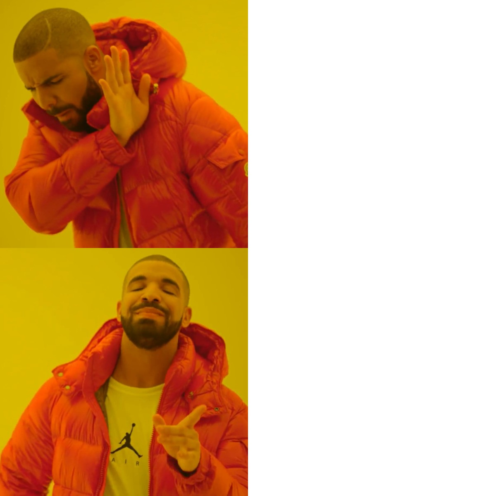
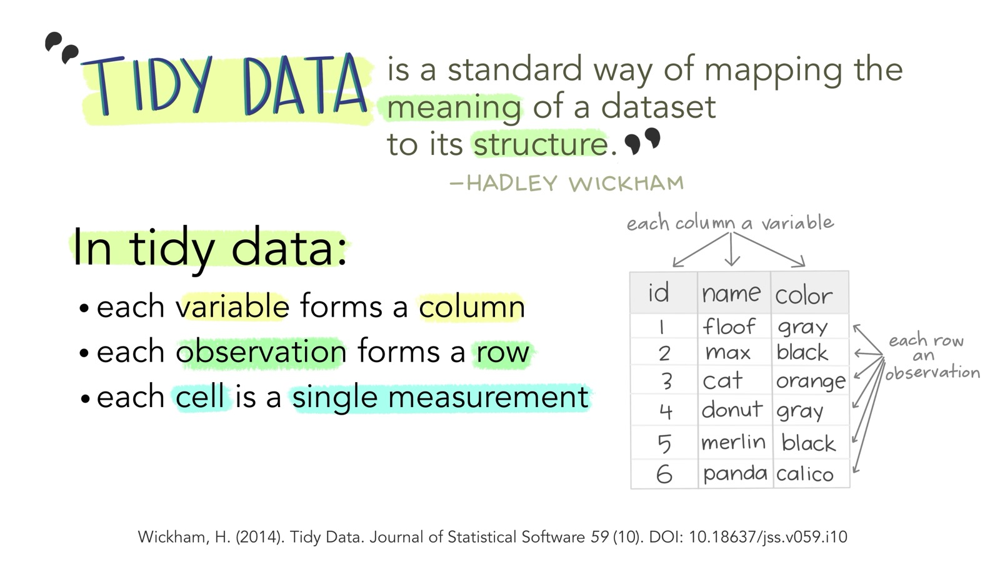

```{r}
#| label: setup
#| include: false
# The outputs on this page are real: they come from running the lab code on the lab data.
library("gt")
library("psymetadata")
library("tidyverse")
knitr::opts_knit$set(root.dir = "../notebooksanddata")
options(width = 72)

agadullina2018_tbl <- as_tibble(agadullina2018)

split_data <-
  split(maldonado2020, maldonado2020$domain) |>
  map_at(c("inhibition", "shifting"), ~ select(.x, author, yi, vi, task)) |>
  map_at(c("processing speed", "updating"),
         ~ select(.x, author, yi, vi, n1, n2, mean_age1, mean_age2))
```

## Before you start

This page walks you through Lab 1 one small step at a time. You don't need any experience with R, coding, or statistics. If a word is new to you, it is explained the first time it appears, and there is a [glossary](#glossary) at the end.

**How it works.** You keep this page open next to RStudio. The page explains each step and shows you exactly what you should see. You type the code into the **lab notebook**, a file that mixes instructions with boxes for code, and **run** it, which means asking R to carry it out. Both are explained step by step below. Take your time: there is no timer.

:::: {.legend}
::: {.l-do}
**Your turn**
Something to do in RStudio. Follow the numbered instructions.
:::
::: {.l-see}
**What you should see**
The real result R gives back. Compare it with yours.
:::
::: {.l-idea}
**Big idea**
A concept worth remembering beyond today.
:::
::: {.l-quiz}
**Check yourself**
A quick question. Click an answer to see if you were right.
:::
::::

At the end of each step there is a **Mark as done** button. Your ticks are saved in this browser, so you can close the page and pick up where you left off. The bar at the top shows how far you've got.

::: {.callout-note title="Plan for about 2–3 hours"}
You don't have to do it all in one go. Parts 1 and 2 are the most important. Part 3 is harder, and it's fine to leave it for another day.
:::

### Open RStudio and the notebook {.step}

**R** is a programming language for working with data. **RStudio** is the program you use to write and run R code. Think of R as the engine and RStudio as the car's dashboard: you only ever touch the dashboard.

::: {.doit q="Open the notebook"}
1. Find the lab folder you downloaded from Moodle, the course website. It contains a file ending in **`.qmd`** (the notebook) and a folder called **`data`**. Keep them together in the same folder.
2. Open **RStudio** (not "R"). On Windows, including the lab computers, search for "RStudio" in the Start menu. On a Mac, press [Cmd]{.kbd} + [Space]{.kbd} and type "RStudio".
3. In RStudio, click **File → Open File…** in the menu at the top, go to the lab folder and open the `.qmd` file whose name contains **student**.
:::

::: {.callout-tip collapse="true" title="Stuck? The download is a single file ending in .zip"}
A **zip file** is a folder squashed into one file to make downloading easier. Unpack it first: on Windows, right-click it and choose **Extract All…**; on a Mac, double-click it. Then use the normal folder that appears, not the zip file.
:::

::: {.callout-tip collapse="true" title="Stuck? I can't see “.qmd” at the end of any file name"}
Windows often hides the last part of file names (the **file extension**, which tells the computer what kind of file it is). Look for the file whose name contains "student" and whose type is shown as "Quarto" or has a blue RStudio-style icon. Opening it through **File → Open File…** in RStudio also works.
:::

When the notebook is open, RStudio looks roughly like this. Each area is called a **pane**.

```{=html}
<div class="rstudio" role="img" aria-label="Diagram of the four RStudio panes">
  <div><b><span class="pn">1</span>Source (the notebook)</b>
    <small>Where the notebook opens. You type code here, in the grey boxes, and the results appear underneath.</small>
    <div class="fake">```{r}
class(agadullina2018)
```</div></div>
  <div><b><span class="pn">2</span>Console</b>
    <small>R's "chat window". You can type a line here and press Enter, but today we mostly work in the notebook.</small>
    <div class="fake">&gt; 1 + 1
[1] 2</div></div>
  <div><b><span class="pn">3</span>Environment</b>
    <small>Shows everything R is currently remembering: the objects you have created. Empty at the start.</small></div>
  <div><b><span class="pn">4</span>Files · Help · Viewer</b>
    <small>Tabs that show the files on your computer, and help pages when you ask for them.</small></div>
</div>
```

::: {.callout-tip collapse="true" title="My panes are in different places, or I only see three"}
That's fine. The layout can differ between computers. When the notebook is open, the Source pane appears; before that, the Console takes up the whole left side.
:::

### Notebooks, chunks and running code {.step}

The notebook mixes two things:

- **Text**, which you read, like the instructions for each question.
- **Code chunks**: grey boxes that contain R code. R only ever looks at what's inside the grey boxes.

Here is what a chunk looks like, and what happens when you run it:

```{=html}
<div class="chunk-demo" aria-label="Diagram of a code chunk">
  <div class="ch-top"><span>```{r}</span><span class="run">⚙ ▼ ▶ ← click the green triangle to run</span></div>
  <div class="ch-code">1 + 1</div>
  <div class="ch-top" style="padding-top:0">```</div>
  <div class="ch-out">[1] 2 &nbsp; ← the output appears here, under the chunk</div>
</div>
```

There are two ways to run code:

| To run… | Do this |
|---|---|
| the **whole chunk** | Click the green **▶** at the top right of the chunk, or press [Ctrl]{.kbd .mod} + [Shift]{.kbd} + [Enter]{.kbd} |
| **one line** | Click anywhere on that line and press [Ctrl]{.kbd .mod} + [Enter]{.kbd} |

Lines starting with `#` are **comments**. R ignores them: they are notes for humans. That's why the empty chunks in the notebook say `# Code here`. You can type your code underneath that line.

::: {.callout-warning title="Don't type the ```{r} lines"}
The lines with ```` ```{r} ```` and ```` ``` ```` mark where a chunk starts and ends. Leave them alone and type your code between them.
:::

### Run the setup chunk {.step}

R comes with a set of basic tools. Other people have written extra tools and shared them as **packages**. Before you can use a package, you load it with `library()`. You do this once each time you open RStudio.

The notebook loads four packages:

| Package | What it gives you |
|---|---|
| `tidyverse` | The main toolkit for today. The **tidyverse** is really a family of packages that are designed to work together and loads them all at once, including **dplyr** (summarising tables, Part 1), **tidyr** (reshaping tables, Part 2), **readr** (reading files, Part 2), **purrr** (repeating steps, Part 3) and **tibble** (a neater kind of table). |
| `psymetadata` | The research data we use in Parts 1 and 3. |
| `gt` | Turns a table into a nicely formatted one for reports (Part 2). |
| `ggsci` | Colour schemes for graphs. Not needed today. |

You don't need to remember which function comes from which package. When this page says "from **dplyr**", it just tells you where a tool lives.

::: {.doit q="Setup chunk"}
1. Scroll to the top of the notebook and find the chunk under **Setup**. It contains four lines starting with `library(`.
2. Click the green **▶** on that chunk.
3. Wait a few seconds. Messages may appear underneath.
:::

::: {.expect}
You may see some text in red, like this (your version numbers may differ). **That's normal.** Red text is not always an **error** (R refusing to run something; there's more on errors below).

```
── Attaching core tidyverse packages ──────────────── tidyverse 2.0.0 ──
✔ dplyr     1.2.1     ✔ readr     2.2.0
✔ forcats   1.0.1     ✔ stringr   1.6.0
✔ ggplot2   4.0.3     ✔ tibble    3.3.1
✔ lubridate 1.9.5     ✔ tidyr     1.3.2
✔ purrr     1.2.2
── Conflicts ───────────────────────────────── tidyverse_conflicts() ──
✖ dplyr::filter() masks stats::filter()
✖ dplyr::lag()    masks stats::lag()
ℹ Use the conflicted package to force all conflicts to become errors
```
:::

The "Conflicts" part just says that two packages have a tool with the same name (for example `filter()`), and the one loaded last wins ("masks" the other). You can ignore it.

::: {.callout-tip collapse="true" title="Stuck? I see “there is no package called …”"}
The package isn't installed on this computer yet. Installing is a one-off step, like installing an app. Click in the **Console** (bottom left), type the line below with the missing package's name, press [Enter]{.kbd}, wait until the `>` prompt comes back, then run the setup chunk again.

```r
install.packages("psymetadata")
```

Do **not** put `install.packages()` inside the notebook: you only need it once, not every time.
:::

## R basics {#basics}

Before we touch any data, let's learn the handful of words R uses. Try each example yourself: click into the **Console**, type the code, and press [Enter]{.kbd}. Mistakes here cost nothing.

### R as a calculator {.step}

::: {.doit q="Console"}
Type each line into the Console and press [Enter]{.kbd} after each one.

```r
2 + 3
10 / 4
2 * (3 + 1)
```
:::

```{r}
#| echo: true
2 + 3
10 / 4
2 * (3 + 1)
```

The `[1]` at the start of each answer just means "this is the first value". You'll see it before almost every result, and you can ignore it for now.

### Objects: giving a value a name {.step}

Usually you want R to **remember** a result so you can use it later. You do this by giving it a name. A named thing in R is called an **object**.

::: {.anatomy}
[`x`]{.tok} [`<-`]{.tok} [`5`]{.tok}

1. The **name** of the new object. You choose it. Names can contain letters, numbers, `_` and `.`, but no spaces.
2. The **assignment arrow**: a `<` followed by a `-`. Read it as "gets": "x gets 5". Shortcut: [Alt]{.kbd .opt-key} + [-]{.kbd}.
3. The **value** to store.
:::

::: {.doit q="Console"}
```r
x <- 5
x
x * 2
```
:::

```{r}
#| echo: true
x <- 5
x
x * 2
```

Notice: the first line printed (showed) **nothing**. When you assign with `<-`, R stores the value silently. Look at the **Environment** pane (top right): `x` now appears there. Typing the name on its own (`x`) asks R to show you what's inside.

::: {.idea}
**If you don't assign it, R forgets it.** `x * 2` showed `10`, but `x` is still `5`. To keep a result, you must save it with `<-`, either under a new name or by overwriting the old one.
:::

::: {.callout-tip collapse="true" title="Stuck? “Error: object 'x' not found”"}
R doesn't know a thing called `x` yet. Either the line `x <- 5` hasn't been run, or the name is spelled differently. Capitals matter: `X` and `x` are two different names.
:::

### Functions: tools that do something {.step}

A **function** is a tool that takes something in, does something with it, and gives something back. You always recognise a function by its round brackets `( )`.

::: {.anatomy}
[`round`]{.tok}`(`[`3.14159`]{.tok}`,` [`digits = 2`]{.tok}`)`

1. The **function's name**: `round` rounds a number.
2. The first **argument**: the input. Arguments are what you put inside the brackets.
3. A **named argument**: an extra setting, written as `name = value`. Arguments are separated by commas.
:::

```{r}
#| echo: true
round(3.14159, digits = 2)
```

Every function has a help page that lists its arguments. To open it, put a `?` in front of the name and run it, for example `?round`. The help appears in the **Help** tab, bottom right. Help pages are written for experienced users, so don't worry if they look dense: the **Description** at the top and the **Examples** at the bottom are the useful parts.

### Text, numbers and TRUE/FALSE {.step}

R treats different kinds of values differently. The kind is called the **type**.

| Type | Example | What it is |
|---|---|---|
| numeric | `57.1` | a number |
| character | `"Niger"` | text. **Always in quotes.** |
| logical | `TRUE`, `FALSE` | yes or no; the answer to a question |
| missing | `NA` | "not available": the value is missing |

The quotes matter. Without them, R thinks a word is the **name of an object** and goes looking for it:

```{r}
#| echo: true
#| error: true
"Niger"
Niger
```

And `"1970"` in quotes is text, not a number: you can't do maths with it. We'll fix exactly this problem in Part 2.

### Vectors: several values in a row {.step}

A **vector** is a sequence of values of the same type. You make one with the function `c()`, short for "combine".

```{r}
#| echo: true
years <- c(1970, 1990, 2010)
years
years + 1
```

Most of R works on whole vectors at once: `years + 1` added 1 to every value. A column in a table is a vector too.

### Asking questions: `==` and `%in%` {.step}

You can ask R yes/no questions. The answer is `TRUE` or `FALSE`, once for every value.

| Question | Write | Example |
|---|---|---|
| is equal to? | `==` | `year == 1990` |
| is not equal to? | `!=` | `design != "Experiment"` |
| greater / less than? | `>` `<` | `n > 100` |
| is one of? | `%in%` | `year %in% c(1970, 1990)` |

```{r}
#| echo: true
years == 1990
years %in% c(1970, 2010)
```

::: {.idea data-label="The most common mistake today"}
```{=html}
<div class="drake" role="img" aria-label="Drake meme: rejecting filter(year = 1990), approving filter(year == 1990)">
  <div class="dk-pic"></div>
  <div class="dk-txt"><code>filter(year = 1990)</code></div>
  <div class="dk-pic dk-bottom"></div>
  <div class="dk-txt"><code>filter(year == 1990)</code></div>
</div>
```
`filter()` is a function that keeps only some rows of a table; you'll use it in Part 2. One `=` **sets** an argument, like `digits = 2`. Two `==` **ask** "is this equal?". If you mix them up, R tells you: *"We detected a named input. This usually means that you've used `=` instead of `==`."*
:::

::: {.quiz}
You have `n <- 50`. What does `n > 100` give back?

::: {.opt}
`50`

::: {.fb}
`>` asks a question, so the answer is `TRUE` or `FALSE`, not a number.
:::
:::

::: {.opt .right}
`FALSE`

::: {.fb}
50 is not greater than 100, so the answer is `FALSE`.
:::
:::

::: {.opt}
An error

::: {.fb}
This is valid code: `n` exists and `>` compares two numbers.
:::
:::
:::

### Reading error messages {.step}

You will see a lot of errors today. Everyone does, including people who have used R for twenty years. An error doesn't break anything: R just refuses to run that line and tells you why. Read the message, fix the line, run it again.

| The message says… | It usually means… |
|---|---|
| `object 'xyz' not found` | A typo in a name, or you haven't run the line that creates it yet |
| `could not find function "xyz"` | A typo in the function name, or the setup chunk hasn't been run |
| `unexpected symbol` / `unexpected ')'` | A missing comma, bracket or quote. Count your brackets: every `(` needs a `)` |
| `there is no package called 'xyz'` | The package needs installing (see the setup step) |

::: {.callout-tip title="The `+` trap"}
If the Console shows `+` instead of `>` at the start of the line, R is waiting for you to finish something, usually a missing `)` or `"`. Press [Esc]{.kbd} to cancel and start the line again.
:::

## Part 1: Summarising data {#part1}

**About 45–60 minutes.** In this part you'll explore a real research dataset and answer a question with it: *do different kinds of studies find different results?* You'll learn the tools `count()`, `mutate()`, `group_by()` and `summarise()`, from a package called **dplyr**.

::: {.callout-note title="Where are we in the notebook?"}
Scroll down in the notebook to **Part 1**. Each step below matches a numbered question there. The notebook skips number 5 (it goes 4, 6, 7…). That's a typo in the notebook, not something you missed.
:::

### About the data

Researchers often want to know what *all* the studies on a topic found, not just one. A **meta-analysis** collects the results of many studies and combines them.

Our dataset, `agadullina2018`, is from a meta-analysis on prejudice. It asks: are people more prejudiced towards groups they see as tight-knit and uniform (psychologists call this **entitativity**)? Each row is one result from one published study.

Each result is summarised as an **effect size**: a single number for how strong the relationship was. Bigger numbers mean a stronger link between seeing a group as uniform and being prejudiced against it. In this data the effect size is in the column `yi`.

The data comes with the `psymetadata` package, so it is already loaded: you don't need to open a file.

### [Q1]{.qtag} Read the documentation {.step}

Before using any dataset, find out what it contains. Datasets that come in packages have a help page (also called **documentation**), just like functions.

::: {.doit q="Part 1 · Q1"}
1. Find **question 1** in Part 1 of the notebook.
2. Click into the chunk under it and type the line below. Then run it.

```r
?agadullina2018
```

3. Look at the **Help** tab, bottom right.
:::

::: {.expect data-label="What you should see in the Help tab"}
```{r}
db <- tools::Rd_db("psymetadata")
tools::Rd2txt(db[["agadullina2018.Rd"]], options = list(underline_titles = FALSE, width = 72))
```
:::

The most useful part is **Format**: it lists each column (also called a **variable**) and what it means. Note three of them:

- `design`: how the study was done. **Cross-sectional** studies measure people's views at one point in time; **experiments** change something on purpose and see what happens.
- `yi`: the effect size.
- `vi`: how uncertain that effect size is (smaller is more precise). We won't use it today.

::: {.callout-tip collapse="true" title="Stuck? Nothing appears, or “No documentation for 'agadullina2018'”"}
The `psymetadata` package isn't loaded yet. Run the setup chunk at the top of the notebook first, then try again.
:::

### [Q2]{.qtag} What kind of object is it? {.step}

Everything in R is an object, and objects come in different kinds, called **classes**. The function `class()` tells you which kind you have.

::: {.doit q="Part 1 · Q2"}
In the chunk under question 2, type and run:

```r
class(agadullina2018)
```
:::

::: {.expect}
```{r}
class(agadullina2018)
```
:::

A **data frame** is R's word for a table: rows and columns, like a spreadsheet. Each column is a vector, and all columns have the same length.

### [Q3]{.qtag} Print the whole thing {.step}

Typing the name of an object on its own and running it **prints** it: R shows you what's inside.

::: {.doit q="Part 1 · Q3"}
In the chunk under question 3, type and run:

```r
agadullina2018
```
:::

::: {.expect}
```{r}
agadullina2018
```
:::

In the notebook, a table appears under the chunk with arrows to page through it. Scroll and click around: there are **85 rows** (one per result) and **9 columns**.

::: {.callout-warning title="Why we don't usually do this"}
This table is small. Real datasets often have millions of rows, and printing them all would flood your screen. The notebook warns you not to print whole data frames in the exam. The next step shows a better way.
:::

### [Q4]{.qtag} Convert it to a tibble {.step}

A **tibble** is a modern kind of data frame. It's the same table, but it prints more helpfully: only the first few rows, plus the size of the table and the type of each column. All the tidyverse tools work with tibbles.

We'll make a tibble version of the data and give it a new name, so we can use it in the rest of Part 1.

::: {.anatomy}
[`agadullina2018_tbl`]{.tok} [`<-`]{.tok} [`as_tibble`]{.tok}`(`[`agadullina2018`]{.tok}`)`

1. The **new name** we're choosing. `_tbl` at the end is a reminder that it's a tibble. Any name works, but you must use the same one later.
2. **Assign**: store the result under that name.
3. The **function** `as_tibble()` converts a data frame to a tibble.
4. The **input**: the original data frame. It is not changed: we get a new copy.
:::

::: {.doit q="Part 1 · Q4"}
In the chunk under question 4, type both lines and run the chunk:

```r
agadullina2018_tbl <- as_tibble(agadullina2018)
agadullina2018_tbl
```

The first line creates the tibble (silently). The second line prints it. Check the **Environment** pane: `agadullina2018_tbl` should now be listed.
:::

::: {.expect}
```{r}
agadullina2018_tbl
```
:::

**How to read this table:**

- The words under each column name, like `<chr>` and `<dbl>`, are the column's **type**: `<chr>` is character (text), `<dbl>` is a number with decimals ("double"), `<int>` a whole number.
- At the bottom, the table says how many rows there are in total.

::: {.callout-tip collapse="true" title="Want to see it as plain text instead?"}
If you type `agadullina2018_tbl` in the **Console** instead of the notebook, the tibble prints as text. The first line tells you its size: `# A tibble: 85 × 9` means 85 rows and 9 columns.

```{r}
#| df-print: default
print(agadullina2018_tbl, n = 5)
```
:::

::: {.callout-tip collapse="true" title="Optional: glimpse()"}
`glimpse(agadullina2018_tbl)` turns the table on its side: one line per column, with the first few values. It's handy when a table has too many columns to fit on the screen.

```{r}
glimpse(agadullina2018_tbl)
```
:::

::: {.callout-tip collapse="true" title="Stuck? “object 'agadullina2018_tbl' not found”"}
You printed the tibble before creating it. Run the line with `<-` first. If you run the whole chunk with ▶, both lines run in order.
:::

### [Q6]{.qtag} Count the study designs {.step}

Our question is whether different kinds of studies find different results. First: how many results come from each kind of study? The function `count()` counts how often each value appears in a column.

::: {.anatomy}
[`count`]{.tok}`(`[`agadullina2018_tbl`]{.tok}`,` [`design`]{.tok}`)`

1. The **function**: count how many rows have each value.
2. **Which table** to use. In the tidyverse, the table always comes first.
3. **Which column** to count. Column names don't need quotes inside tidyverse functions.
:::

::: {.doit q="Part 1 · Q6"}
```r
count(agadullina2018_tbl, design)
```
:::

::: {.expect}
```{r}
count(agadullina2018_tbl, design)
```
:::

The result is a new, small table: each design, and in the column `n`, how many rows have it. So 71 results come from cross-sectional studies and 14 from experiments.

### [Q7]{.qtag} The pipe `|>` {.step}

The **pipe** `|>` is the most useful symbol you'll learn today. It takes whatever is on its left and passes it into the function on its right, as the first input. Read it as **"and then"**.

```{=html}
<div class="twocol">
<div><p class="cap">Without a pipe</p>
```

```r
count(agadullina2018_tbl, design)
```

```{=html}
</div><div><p class="cap">With a pipe</p>
```

```r
agadullina2018_tbl |>
  count(design)
```

```{=html}
</div></div>
```

Both lines do exactly the same thing. The second reads: "take `agadullina2018_tbl`, **and then** count `design`".

::: {.doit q="Part 1 · Q7"}
1. In the chunk under question 7, type the piped version.
2. To type the pipe, press [Ctrl]{.kbd .mod} + [Shift]{.kbd} + [M]{.kbd}, or type `|` then `>`. The `|` key is usually above [Enter]{.kbd} or next to [Shift]{.kbd}.
3. Press [Enter]{.kbd} after the pipe to start a new line. RStudio indents the next line for you (moves it in a little), which shows that it belongs to the same instruction.
4. Run the chunk.
:::

::: {.expect}
```{r}
agadullina2018_tbl |>
  count(design)
```
:::

The same result as Q6. With one step the pipe makes no difference. Its benefit shows when you chain several steps, as you'll do next.

::: {.callout-tip collapse="true" title="Stuck? The shortcut types %>% instead of |>"}
`%>%` is an older version of the pipe and works the same way for today. To switch: **Tools → Global Options → Code**, tick **Use native pipe operator, |>**, and click OK.
:::

::: {.callout-tip collapse="true" title="Stuck? “unexpected '>'”"}
There's a space between `|` and `>`. They must be typed right next to each other: `|>`.
:::

### [Q8]{.qtag} Add a percentage column with `mutate()` {.step}

Counts are useful, but percentages are easier to compare. `mutate()` **adds a new column** (or changes an existing one), calculated from the columns you already have.

::: {.anatomy}
[`mutate`]{.tok}`(`[`pct`]{.tok} [`=`]{.tok} [`(n / sum(n)) * 100`]{.tok}`)`

1. The **function**: add or change a column.
2. The **name** of the new column. You choose it; `pct` is short for percentage.
3. A single `=`: here it means "set the new column to…".
4. The **calculation**: each count `n`, divided by the total of all counts `sum(n)`, times 100.
:::

Now chain it onto the counting step with another pipe. Click **Start** below to go through the code one line at a time.

::::: {.walk}
:::: {.walk-code}
```r
agadullina2018_tbl |>
  count(design) |>
  mutate(pct = (n / sum(n)) * 100)
```
::::

:::: {.walk-step lines="1"}
Start with the data: one row per result, 85 rows.

```{r}
agadullina2018_tbl
```
::::

:::: {.walk-step lines="1-2"}
**and then** count the designs. The pipe passes the table into `count()`. Now we have a small table with 2 rows.

```{r}
agadullina2018_tbl |>
  count(design)
```
::::

:::: {.walk-step lines="1-3"}
**and then** add a column. `mutate()` receives the small count table, and calculates `pct` for each row: 71 out of 85 is 83.5%, 14 out of 85 is 16.5%.

```{r}
agadullina2018_tbl |>
  count(design) |>
  mutate(pct = (n / sum(n)) * 100)
```
::::
:::::

::: {.doit q="Part 1 · Q8"}
Type the three lines into the chunk under question 8 and run it. Notice that every line except the last **ends with a pipe**: that's what tells R the next line continues the same instruction.
:::

::: {.callout-tip collapse="true" title="Stuck? “object 'n' not found”"}
`n` only exists after `count()` has made it. Check that `count(design)` comes before `mutate()`, and that the line with `count` ends with `|>`.
:::

### [Q9]{.qtag} Average effect size with `summarise()` {.step}

Now the actual research question. What is the **average** effect size? `summarise()` collapses a whole table into a single row of summary numbers. Inside it, `mean()` calculates an average.

::: {.anatomy}
[`summarise`]{.tok}`(`[`agadullina2018_tbl`]{.tok}`,` [`yi`]{.tok} `=` [`mean(yi)`]{.tok}`)`

1. The **function**: collapse many rows into one.
2. **Which table.**
3. The **name** of the column in the result. We reuse `yi`, but you could call it `mean_effect` or anything else.
4. **What to calculate**: the mean (average) of the column `yi`.
:::

::: {.doit q="Part 1 · Q9"}
```r
summarise(agadullina2018_tbl, yi = mean(yi))
```

The notebook says "per study", but this calculates **one** average over all 85 results. Splitting it up comes in the next step.
:::

::: {.expect}
```{r}
summarise(agadullina2018_tbl, yi = mean(yi))
```
:::

One row, one number: on average, the effect size is about 0.41.

### [Q10]{.qtag} Averages per group with `group_by()` {.step}

But do cross-sectional studies and experiments find the *same* thing? To get one average **per design**, put `group_by(design)` before `summarise()`.

::: {.idea}
`group_by()` on its own changes nothing you can see. It puts an invisible label on each row, saying which group it belongs to. It changes how the **next** step behaves: `summarise()` then makes one row **per group** instead of one row in total.
:::

::::: {.walk}
:::: {.walk-code}
```r
agadullina2018_tbl |>
  group_by(design) |>
  summarise(yi = mean(yi))
```
::::

:::: {.walk-step lines="1"}
Start with the data: 85 rows.

```{r}
agadullina2018_tbl
```
::::

:::: {.walk-step lines="1-2"}
`group_by(design)` sorts the rows into two groups. The table looks exactly the same. Only when it's printed as text do you see a hint: the line `# Groups: design [2]` says there are 2 groups.

```{r}
#| df-print: default
agadullina2018_tbl |>
  group_by(design) |>
  print(n = 5)
```
::::

:::: {.walk-step lines="1-3"}
`summarise()` now works **within each group**: one row per design, each with its own average. Cross-sectional studies: 0.468. Experiments: 0.111.

```{r}
agadullina2018_tbl |>
  group_by(design) |>
  summarise(yi = mean(yi))
```
::::
:::::

::: {.doit q="Part 1 · Q10"}
Type the three lines into the chunk under question 10 and run it. Then try removing the `group_by` line and running it again: you're back to one row.
:::

::: {.callout-tip collapse="true" title="Stuck? I only get one row"}
`group_by(design)` is missing, or it comes after `summarise()`. The order matters: group first, then summarise.
:::

### [Q11]{.qtag} What have we found out? {.step}

Time to put the results into words. This is the point of all the code: answering a question.

::: {.quiz}
Which statement matches our results?

::: {.opt}
Experiments find larger effects than cross-sectional studies.

::: {.fb}
Look again at the Q10 result: experiments average 0.111 and cross-sectional studies 0.468.
:::
:::

::: {.opt .right}
Most results come from cross-sectional studies, and they find much larger effects than experiments.

::: {.fb}
84% of the results are cross-sectional (Q8), and their average effect is about four times as large as for experiments (Q10).
:::
:::

::: {.opt}
Both kinds of study find about the same effect.

::: {.fb}
0.468 and 0.111 are quite different. The kind of study seems to matter.
:::
:::
:::

::: {.callout-note title="Something to think about"}
A simple average treats every result as equally trustworthy. But some come from big, precise studies and some from small ones (that's what `vi` measures). Real meta-analyses give more weight to more precise results. You'll learn how later in the course.
:::

**Part 1 done.** You've used four of the tools that cover most everyday data work. A good moment for a break.

## Part 2: Tidy data and reshaping {#part2}

**About 45–60 minutes.** Here you'll load a real file from the World Bank, discover that its layout makes it hard to analyse, and **reshape** it. You'll learn `read_csv()`, `rename()`, `pull()`, `pivot_longer()`, `filter()`, `pivot_wider()` and `gt()`, from the **readr**, **dplyr**, **tidyr** and **gt** packages. Each is explained when you get to it.

### What is tidy data? {.step}

The same information can be laid out in a table in many ways. Most R tools expect one particular layout, called **tidy data**:

{fig-alt="Illustration: in tidy data, each variable forms a column, each observation forms a row, and each cell is a single measurement"}

::: {.credit}
Illustration: Julia Lowndes and Allison Horst, [*Tidy Data for reproducibility, efficiency, and collaboration*](https://openscapes.org/blog/2020/10/12/tidy-data/), Openscapes, 2020. CC BY 4.0.
:::

- A **variable** is something you measure: a country, a year, a life expectancy.
- An **observation** is one "case" you measured: here, one country in one year.

Our World Bank file shows **life expectancy** (how many years a newborn baby can expect to live) for every country, for every year from 1960 to 2024. It's laid out like this:

:::: {.twocol}
::: {}
```{=html}
<p class="cap">Wide: how the file looks <small>263 rows × 67 columns</small></p>
<table class="mini">
<tr><th>Country Name</th><th class="hl">1970</th><th class="hl">1990</th><th class="hl">2010</th><th>…</th></tr>
<tr><td>Burkina Faso</td><td>39.5</td><td>49.3</td><td>56.3</td><td>…</td></tr>
<tr><td>Honduras</td><td>54.4</td><td>65.2</td><td>69.8</td><td>…</td></tr>
<tr><td>Niger</td><td>35.9</td><td>41.7</td><td>57.1</td><td>…</td></tr>
</table>
```
Easy for a human to read. But **year** is a variable, and here it is hidden in the column names. There's no column called "year" that you could filter or group by.
:::
::: {}
```{=html}
<p class="cap">Long (tidy): what we want <small>3 columns</small></p>
<table class="mini">
<tr><th>country_name</th><th class="hl">year</th><th>lifeexp</th></tr>
<tr><td>Burkina Faso</td><td class="hl">1970</td><td>39.5</td></tr>
<tr><td>Burkina Faso</td><td class="hl">1990</td><td>49.3</td></tr>
<tr><td>Burkina Faso</td><td class="hl">2010</td><td>56.3</td></tr>
<tr><td>Honduras</td><td class="hl">1970</td><td>54.4</td></tr>
<tr><td>…</td><td>…</td><td>…</td></tr>
</table>
```
One row per country **and** year. Every variable has its own column, so the tools from Part 1 work.
:::
::::

::: {.idea}
**Wide** is good for **showing** a table to people. **Long** is good for **analysing** it. Most data cleaning is about getting data into the long, tidy shape.
:::

### [Q1]{.qtag} Load the file and rename a column {.step}

So far the data came inside a package. Now we load a file from your computer. The file is a **CSV** ("comma-separated values"): a plain-text table where commas separate the columns. Excel can open it too.

`read_csv()` reads a CSV file and turns it into a tibble. You tell it **where the file is** with a **path**:

::: {.anatomy}
[`read_csv`]{.tok}`(`[`"data/wb-life-exp.csv"`]{.tok}`)`

1. The **function** that reads CSV files.
2. The **path**: "inside the folder `data`, the file `wb-life-exp.csv`". It's text, so it goes in quotes. The `/` separates a folder from what's inside it.
:::

The path starts from the folder the notebook is in. So this only works if the `data` folder sits next to the notebook file. You can check in the **Files** tab, bottom right.

The first column is called `Country Name`, with a space and capitals. Spaces in names are awkward in code, so we rename it to `country_name`, using `rename(new_name = old_column)`. Instead of typing the old name, you can give its **position**: `1` means "the first column".

::::: {.walk}
:::: {.walk-code}
```r
lifeexp <- read_csv("data/wb-life-exp.csv") |>
  rename(country_name = 1)
lifeexp
```
::::

:::: {.walk-step lines="1"}
`read_csv()` reads the file. Look at the first column's name, `Country Name`, and the year columns: 1960, 1961, … R also prints a short message about the column types it guessed.

```{r}
read_csv("data/wb-life-exp.csv")
```
::::

:::: {.walk-step lines="1-2"}
**and then** `rename()` changes the first column's name to `country_name`. The whole result is saved under the name `lifeexp` (short for life expectancy), thanks to the `<-` at the start.

The arrow saves the result of the **whole** pipeline, not just the first line.
::::

:::: {.walk-step lines="3"}
Print it to check. The first column is now called `country_name`.

```{r}
lifeexp <- read_csv("data/wb-life-exp.csv") |>
  rename(country_name = 1)
lifeexp
```
::::
:::::

::: {.doit q="Part 2 · Q1"}
1. Scroll to **Part 2** in the notebook, question 1.
2. Type the three lines and run the chunk.
3. Check that `lifeexp` appears in the **Environment** pane, with 263 obs. (observations, or rows) of 67 variables.
:::

::: {.callout-tip collapse="true" title="Stuck? “'data/wb-life-exp.csv' does not exist in current working directory”"}
R can't find the file at that path. The **working directory** is the folder R starts looking in; for a notebook, that's the folder the notebook is in. Check, in this order:

1. In the **Files** tab, go to the folder that contains the notebook. Is there a folder called `data`, with `wb-life-exp.csv` inside?
2. If the CSV is next to the notebook instead (not in a `data` folder), drop the folder from the path: `read_csv("wb-life-exp.csv")`.
3. Did the download rename the file, for example to `wb-life-exp (1).csv`? Rename the file, or use its exact name in the path.
4. Did you open the notebook straight from your Downloads or from inside a zip file? Unzip the folder first, then open the notebook again from the unzipped folder.
:::

### [Q2]{.qtag} Look at all the countries with `pull()` {.step}

`pull()` takes one column out of a table and gives it to you as a plain vector: just the values, in a row. It's a quick way to look through everything in a column.

::: {.doit q="Part 2 · Q2"}
```r
pull(lifeexp, country_name)
```

Scroll through the output. Is every name a country?
:::

::: {.expect data-label="What you should see (the first 60 of 263 names)"}
```{r}
pull(lifeexp, country_name) |> head(60)
```
:::

::: {.callout-warning title="Real data is messy"}
Not every row is a country. About 46 rows are **groups of countries**: "Arab World", "Euro area", "High income", "World", and so on. If you averaged across all rows, you'd count many countries twice. Always look at your data before you analyse it.
:::

### [Q3]{.qtag} Reshape from wide to long with `pivot_longer()` {.step}

Now the main event. `pivot_longer()` turns a wide table into a long one. It needs answers to three questions:

::: {.anatomy}
[`pivot_longer`]{.tok}`(`[`-country_name`]{.tok}`,` [`names_to = "year"`]{.tok}`,` [`values_to = "lifeexp"`]{.tok}`)`

1. The **function**: make the table longer.
2. **Which columns should be stacked?** All the year columns. Rather than listing 65 years, we say "everything *except* `country_name`": the minus sign means "not this one".
3. **Where should the old column names go?** Into a new column called `year`. Its name is new, so it's in quotes.
4. **Where should the numbers go?** Into a new column called `lifeexp`.
:::

```{=html}
<div class="twocol" style="align-items:center">
<div>
<p class="cap">Before <small>one row per country</small></p>
<table class="mini">
<tr><th>country_name</th><th class="hl">1970</th><th class="hl">1990</th></tr>
<tr><td>Niger</td><td>35.9</td><td>41.7</td></tr>
</table>
</div>
<div>
<p class="cap">After <small>one row per country and year</small></p>
<table class="mini">
<tr><th>country_name</th><th class="hl">year</th><th>lifeexp</th></tr>
<tr><td>Niger</td><td class="hl">"1970"</td><td>35.9</td></tr>
<tr><td>Niger</td><td class="hl">"1990"</td><td>41.7</td></tr>
</table>
</div>
</div>
```

::: {.doit q="Part 2 · Q3"}
```r
lifeexp |>
  pivot_longer(-country_name, names_to = "year", values_to = "lifeexp")
```

You can split a long line after any comma to make it easier to read. RStudio keeps it as one instruction until the closing bracket.
:::

::: {.expect}
```{r}
lifeexp |>
  pivot_longer(-country_name, names_to = "year", values_to = "lifeexp")
```
:::

The table now has 3 columns and 17,358 rows: 263 rows × 66 year columns. Look at the type under `year`: `<chr>`, text. The years came from column names, and column names are always text. We fix that next.

::: {.callout-note title="Why are there NAs?"}
`NA` means a value is missing. Some countries have no data for early years, and the file's last column, `2025`, is completely empty because that year isn't over yet. You could remove those rows by adding `values_drop_na = TRUE` inside `pivot_longer()`.
:::

::: {.callout-tip collapse="true" title="Stuck? “object 'year' not found” or “unexpected symbol”"}
New column names in `names_to` and `values_to` need quotes: `"year"`, `"lifeexp"`. And check the commas between the three parts.
:::

### [Q4]{.qtag} Turn the years into numbers with `parse_number()` {.step}

`parse_number()` takes text and pulls the number out of it: `"1970"` becomes `1970`. We use it inside `mutate()`, which you know from Part 1. This time, `mutate()` **replaces** the `year` column with a new version of itself.

::: {.anatomy}
[`mutate`]{.tok}`(`[`year`]{.tok} `=` [`parse_number(year)`]{.tok}`)`

1. Change or add a column.
2. The column to create. It already exists, so it is **overwritten**.
3. The new values: the numbers from the old text in `year`.
:::

::: {.doit q="Part 2 · Q4"}
Copy your code from Q3 into the chunk under Q4, add a pipe at the end of the last line, and add the `mutate` line:

```r
lifeexp |>
  pivot_longer(-country_name, names_to = "year", values_to = "lifeexp") |>
  mutate(year = parse_number(year))
```
:::

::: {.expect}
```{r}
lifeexp |>
  pivot_longer(-country_name, names_to = "year", values_to = "lifeexp") |>
  mutate(year = parse_number(year))
```
:::

The type under `year` is now `<dbl>`: a number. Now we can ask number questions like "is the year 1990?".

::: {.idea data-label="How pipelines grow"}
Each question adds one line to the end of the previous answer. You never rewrite from scratch: copy the last working version, add `|>`, add the next step, run. If it breaks, the problem is almost always in the line you just added.
:::

### [Q5]{.qtag} Keep four countries and three years with `filter()` {.step}

`filter()` **keeps the rows** for which a question is answered `TRUE`, and drops the rest. Remember `%in%` from the basics: it asks "is this value one of these?".

::: {.anatomy}
[`filter`]{.tok}`(`[`country_name %in% c("Niger", "Honduras")`]{.tok}`,` [`year %in% c(1970, 1990, 2010)`]{.tok}`)`

1. **Keep the rows** where the answers are `TRUE`.
2. First question: is the country one of these? Country names are text, so they're in quotes, and must match the data **exactly**, including capitals.
3. Second question: is the year one of these? Years are now numbers, so no quotes. A comma between questions means **both** must be true.
:::

::: {.doit q="Part 2 · Q5"}
1. Pick **four countries** you're curious about. Use the names from Q2 to copy their exact spelling.
2. Add a `filter()` line to your pipeline. Here's an example with four countries; swap in your own:

```r
lifeexp |>
  pivot_longer(-country_name, names_to = "year", values_to = "lifeexp") |>
  mutate(year = parse_number(year)) |>
  filter(country_name %in% c("Burkina Faso", "Honduras", "Niger", "Suriname"),
         year %in% c(1970, 1990, 2010))
```
:::

::: {.expect data-label="What you should see (with the example countries)"}
```{r}
lifeexp |>
  pivot_longer(-country_name, names_to = "year", values_to = "lifeexp") |>
  mutate(year = parse_number(year)) |>
  filter(country_name %in% c("Burkina Faso", "Honduras", "Niger", "Suriname"),
         year %in% c(1970, 1990, 2010))
```
:::

4 countries × 3 years = 12 rows.

::: {.callout-tip collapse="true" title="Stuck? I get 0 rows, or fewer than 12"}
- A country name doesn't match the data exactly. Copy it from the `pull()` output. For example, the data says "Egypt, Arab Rep.", not "Egypt".
- The years are in quotes. After Q4 they're numbers, so write `1970`, not `"1970"`.
- You used `==` instead of `%in%`. `==` compares values one by one in order, and quietly gives the wrong rows. To check against several values, always use `%in%`.
:::

### [Q6]{.qtag} Back to wide with `pivot_wider()` {.step}

The long format was good for filtering. But to **show** the result to someone, one row per country with a column per year is easier to read. `pivot_wider()` is the reverse of `pivot_longer()`.

::: {.anatomy}
[`pivot_wider`]{.tok}`(`[`names_from = year`]{.tok}`,` [`values_from = lifeexp`]{.tok}`)`

1. The **function**: make the table wider.
2. **Where do the new column names come from?** From the values in `year`. The column exists already, so no quotes.
3. **Where do the values in the cells come from?** From `lifeexp`.
:::

::: {.doit q="Part 2 · Q6"}
Add one more pipe and the `pivot_wider()` line to your pipeline from Q5:

```r
lifeexp |>
  pivot_longer(-country_name, names_to = "year", values_to = "lifeexp") |>
  mutate(year = parse_number(year)) |>
  filter(country_name %in% c("Burkina Faso", "Honduras", "Niger", "Suriname"),
         year %in% c(1970, 1990, 2010)) |>
  pivot_wider(names_from = year, values_from = lifeexp)
```
:::

::: {.expect}
```{r}
lifeexp |>
  pivot_longer(-country_name, names_to = "year", values_to = "lifeexp") |>
  mutate(year = parse_number(year)) |>
  filter(country_name %in% c("Burkina Faso", "Honduras", "Niger", "Suriname"),
         year %in% c(1970, 1990, 2010)) |>
  pivot_wider(names_from = year, values_from = lifeexp)
```
:::

::: {.callout-tip collapse="true" title="Optional: round the numbers"}
To keep one decimal place, add `lifeexp = round(lifeexp, 1)` to the `mutate()`: `mutate(year = parse_number(year), lifeexp = round(lifeexp, 1))`. The completed notebook does this, and also shows five years (1970, 1980, 1990, 2000, 2010).
:::

### [Q7]{.qtag} Make a nice table with `gt()` {.step}

`gt()` (from the gt package, short for "grammar of tables") turns a tibble into a formatted table that you could put in a report.

::: {.doit q="Part 2 · Q7"}
Add `|> gt()` to the end of your pipeline. Here is the whole thing. Step through it below to see what each line does.
:::

::::: {.walk}
:::: {.walk-intro}
This is the full pipeline from Part 2. Press **Start** to replay it one step at a time.
::::

:::: {.walk-code}
```r
lifeexp |>
  pivot_longer(-country_name,
               names_to = "year",
               values_to = "lifeexp") |>
  mutate(year = parse_number(year),
         lifeexp = round(lifeexp, 1)) |>
  filter(country_name %in% c("Burkina Faso",
           "Honduras", "Niger", "Suriname"),
         year %in% c(1970, 1990, 2010)) |>
  pivot_wider(names_from = year,
              values_from = lifeexp) |>
  gt()
```
::::

:::: {.walk-step lines="1"}
The wide table we loaded: 263 rows, one per country or region; one column per year.

```{r}
lifeexp
```
::::

:::: {.walk-step lines="1-4"}
`pivot_longer()` stacks the year columns: one row per country and year, 17,358 rows.

```{r}
lifeexp |>
  pivot_longer(-country_name,
               names_to = "year",
               values_to = "lifeexp")
```
::::

:::: {.walk-step lines="1-6"}
`mutate()` turns `year` into a number and rounds life expectancy to one decimal.

```{r}
lifeexp |>
  pivot_longer(-country_name,
               names_to = "year",
               values_to = "lifeexp") |>
  mutate(year = parse_number(year),
         lifeexp = round(lifeexp, 1))
```
::::

:::: {.walk-step lines="1-9"}
`filter()` keeps four countries in three years: 12 rows.

```{r}
lifeexp |>
  pivot_longer(-country_name,
               names_to = "year",
               values_to = "lifeexp") |>
  mutate(year = parse_number(year),
         lifeexp = round(lifeexp, 1)) |>
  filter(country_name %in% c("Burkina Faso",
           "Honduras", "Niger", "Suriname"),
         year %in% c(1970, 1990, 2010))
```
::::

:::: {.walk-step lines="1-11"}
`pivot_wider()` spreads the years back out into columns: one row per country.

```{r}
lifeexp |>
  pivot_longer(-country_name,
               names_to = "year",
               values_to = "lifeexp") |>
  mutate(year = parse_number(year),
         lifeexp = round(lifeexp, 1)) |>
  filter(country_name %in% c("Burkina Faso",
           "Honduras", "Niger", "Suriname"),
         year %in% c(1970, 1990, 2010)) |>
  pivot_wider(names_from = year,
              values_from = lifeexp)
```
::::

:::: {.walk-step lines="1-12"}
`gt()` formats the table for a report.

```{r}
lifeexp |>
  pivot_longer(-country_name,
               names_to = "year",
               values_to = "lifeexp") |>
  mutate(year = parse_number(year),
         lifeexp = round(lifeexp, 1)) |>
  filter(country_name %in% c("Burkina Faso",
           "Honduras", "Niger", "Suriname"),
         year %in% c(1970, 1990, 2010)) |>
  pivot_wider(names_from = year,
              values_from = lifeexp) |>
  gt()
```
::::
:::::

### [Q8]{.qtag} What have you found out? {.step}

Look at your table. Which of your countries gained the most years of life expectancy between 1970 and 2010? Did any of them go down for a while?

::: {.quiz}
In the example table, which country gained the most between 1970 and 2010?

::: {.opt}
Suriname

::: {.fb}
Suriname went from 59.5 to 69.6: about +10 years, the smallest gain of the four.
:::
:::

::: {.opt .right}
Niger

::: {.fb}
Niger went from 35.9 to 57.1: more than 21 extra years. Most of that gain came after 1990.
:::
:::

::: {.opt}
Honduras

::: {.fb}
Honduras gained about 15 years (54.4 to 69.8): a lot, but less than Niger.
:::
:::
:::

::: {.idea data-label="The shape of most data work"}
**read → rename → reshape → fix types → filter → reshape back → present.** You've just done a complete small analysis. Most data projects follow this same shape, just with more steps.
:::

## Part 3: Doing the same thing many times {#part3}

**About 30–45 minutes. This part is harder**, so go slowly, and it's fine to stop here and come back another day. You'll learn `map()` and `bind_rows()`, from the **purrr** and **dplyr** packages.

### Data that comes in pieces {.step}

Sometimes data doesn't arrive as one table but as several: one file per year, one spreadsheet tab per region. In R, you can keep several tables together in a **list**.

A **list** is a container that can hold anything, including whole tables. Think of it as a box with several labelled compartments.

The data for this part is another meta-analysis, `maldonado2020`: 1,268 results on how ageing affects **executive functions**, the mental skills you use to plan, focus and switch between tasks. The notebook splits it into a list of four tables, one per skill:

```{=html}
<p class="cap"><code>split_data</code>: a list of 4 tables</p>
<div class="listbox">
  <div class="df"><b>289 rows</b>inhibition<br><small>ignoring distractions</small></div>
  <div class="df"><b>270 rows</b>processing speed<br><small>how fast you think</small></div>
  <div class="df"><b>208 rows</b>shifting<br><small>switching between tasks</small></div>
  <div class="df"><b>501 rows</b>updating<br><small>working memory</small></div>
</div>
```

::: {.doit q="Part 3 · Q1"}
Find question 1 in Part 3. The chunk already contains code that builds `split_data`. **You don't need to understand it**: just run it with the green ▶. Check that `split_data` appears in the **Environment** pane as a "List of 4".
:::

::: {.callout-tip collapse="true" title="Stuck? “object 'maldonado2020' not found”"}
`maldonado2020` comes with the `psymetadata` package. Run the setup chunk at the top of the notebook, then this chunk again.
:::

### [Q2]{.qtag} Apply a function to every piece with `map()` {.step}

Say you want to see the first 5 rows of each table. You could write the same line four times, once per table. But that's tedious, and every copy is a chance for a typo. `map()` does it for you: it takes a list and a function, and **applies the function to every piece**.

```{=html}
<div class="twocol" style="grid-template-columns: 1fr auto 1fr auto 1fr; align-items:center; text-align:center; gap:10px">
  <div class="idea" style="margin:0;padding:.8em"><b>A list</b><br>4 tables</div><div>→</div>
  <div class="idea" style="margin:0;padding:.8em;background:var(--do-tint)"><b><code>map(list, f)</code></b><br>do f to each one</div><div>→</div>
  <div class="idea" style="margin:0;padding:.8em"><b>A list</b><br>4 results</div>
</div>
```

To say *what* to do to each piece, you write a small recipe with a `~` (tilde) and `.x`:

::: {.anatomy}
[`map`]{.tok}`(`[`split_data`]{.tok}`,` [`~`]{.tok} [`head(`]{.tok}[`.x`]{.tok}[`, 5)`]{.tok}`)`

1. The **function**: do something to every piece of a list.
2. **Which list.**
3. The **tilde** `~` means "here comes a recipe". On most keyboards it's [Shift]{.kbd} + the key next to [1]{.kbd} or next to [Enter]{.kbd}.
4. The **recipe**: what to do with each piece. `head()` shows the first rows of a table.
5. `.x` is a placeholder for **"the current piece"**. `map()` swaps in each table in turn: first inhibition, then processing speed, and so on.
6. Show 5 rows.
:::

::: {.doit q="Part 3 · Q2"}
```r
map(split_data, ~ head(.x, 5))
```
:::

::: {.expect}
```{r}
#| df-print: default
map(split_data, ~ head(.x, 5))
```
:::

The result is again a list of four. Each piece is labelled with `$` and its name, like `$inhibition`. Notice that the pieces have **different columns**: only `author`, `yi` and `vi` appear in all four.

::: {.callout-tip collapse="true" title="Stuck? “object '.x' not found”"}
You forgot the `~` before the recipe. Without it, R tries to run `head(.x, 5)` straight away, before `map()` has filled in `.x`.
:::

### [Q3]{.qtag} Try other functions inside `map()` {.step}

If the function needs nothing but the piece itself, you can just give its name, without `~` or `.x`. For example, `colnames()` lists a table's column names:

::: {.doit q="Part 3 · Q3"}
Try these, one at a time. Run each and look at what comes back.

```r
map(split_data, colnames)
map(split_data, as_tibble)
map(split_data, ~ select(.x, author, yi, vi))
```
:::

::: {.expect data-label="What you should see for the first line"}
```{r}
map(split_data, colnames)
```
:::

`select()` is new: it **keeps only the columns you name**. Where `filter()` picks rows, `select()` picks columns. We keep the three columns that every piece has.

Now combine the last two into one recipe. Inside the recipe, you can use a pipe, just like before:

::::: {.walk}
:::: {.walk-code}
```r
map(
  split_data,
  ~ .x |>
    as_tibble() |>
    select(author, yi, vi)
)
```
::::

:::: {.walk-step lines="1-2"}
`map()` is going to go through `split_data`, piece by piece. Spreading the code over several lines makes it easier to read; the brackets show where `map(` starts and ends.
::::

:::: {.walk-step lines="3"}
For each piece: start with that piece, `.x`, **and then**…
::::

:::: {.walk-step lines="4"}
…turn it into a tibble, **and then**…
::::

:::: {.walk-step lines="5-6"}
…keep the three columns `author`, `yi` and `vi`. The `)` on the last line closes `map(`. The result: a list of four tibbles, all with the same three columns. (Shortened to 3 rows each here.)

```{r}
#| df-print: default
local({
  op <- options(tibble.print_min = 3, tibble.print_max = 3)
  on.exit(options(op))
  print(map(
    split_data,
    ~ .x |>
      as_tibble() |>
      select(author, yi, vi)
  ))
})
```
::::
:::::

::: {.callout-tip collapse="true" title="Stuck? “Column `task` doesn't exist”"}
You selected a column that only some pieces have. `map()` applies the same recipe to every piece, so it must work for all of them. Check with `map(split_data, colnames)` and pick columns that appear everywhere.
:::

### [Q4]{.qtag} Stack the pieces back together with `bind_rows()` {.step}

Now that every piece has the same columns, we can stack them on top of each other into one big table. `bind_rows()` does exactly that.

But if we just stack them, we lose track of which piece each row came from. `.id = "domain"` adds a new column, `domain`, that records the name of the piece.

::::: {.walk}
:::: {.walk-code}
```r
map(
  split_data,
  ~ .x |>
    as_tibble() |>
    select(author, yi, vi)
) |>
  bind_rows(.id = "domain")
```
::::

:::: {.walk-step lines="1-6"}
The list of four tibbles from Q3, each with the same three columns.

```{r}
#| df-print: default
local({
  op <- options(tibble.print_min = 3, tibble.print_max = 3)
  on.exit(options(op))
  print(map(
    split_data,
    ~ .x |>
      as_tibble() |>
      select(author, yi, vi)
  ))
})
```
::::

:::: {.walk-step lines="1-7"}
**and then** `bind_rows()` stacks them into one table of 1,268 rows. The new first column, `domain`, says which piece each row came from.

```{r}
map(
  split_data,
  ~ .x |>
    as_tibble() |>
    select(author, yi, vi)
) |>
  bind_rows(.id = "domain")
```
::::
:::::

::: {.doit q="Part 3 · Q4"}
Type the code into the chunk under question 4 and run it. Check: the result should have **1,268 rows** and **4 columns**.
:::

### [Q5]{.qtag} Bonus: both steps at once with `map_dfr()` {.step}

`map_dfr()` does `map()` and `bind_rows()` in one go. The `dfr` stands for "data frame, by rows". It gives the same table as Q4.

::: {.doit q="Part 3 · Q5"}
```r
map_dfr(
  split_data,
  ~ .x |>
    as_tibble() |>
    select(author, yi, vi),
  .id = "domain"
)
```
:::

::: {.callout-note title="You may see map_dfr() described as “superseded”"}
That means there's a newer way to do the same thing, `map(...) |> list_rbind()`, but the old one still works. You'll see `map_dfr()` in a lot of code online.
:::

## Wrap-up {#wrapup}

### What you learned {.step}

:::: {.legend}
::: {.l-idea}
**Part 1 · dplyr**
`count`, `mutate`, `group_by` and `summarise`, chained with `|>`, cover most everyday summaries.
:::
::: {.l-idea}
**Part 2 · tidyr**
Tidy data has one variable per column and one observation per row. `pivot_longer()` and `pivot_wider()` switch between shapes.
:::
::: {.l-idea}
**Part 3 · purrr**
`map()` applies one recipe to every piece of a list. `bind_rows()` stacks the results.
:::
::::

**One question to take away:** think of the data you might use for your own project. Is it tidy? If not, which rule does it break?

::: {.callout-tip title="Save your work"}
Press [Ctrl]{.kbd .mod} + [S]{.kbd} in RStudio to save the notebook. Your code is saved in the `.qmd` file, so next time you can open it and run everything again.
:::

**Further reading**

- [R for Data Science (2e)](https://r4ds.hadley.nz), free online: the chapters on data transformation, data tidying and iteration cover today's material in more depth.
- Two-page cheat sheets for [dplyr](https://rstudio.github.io/cheatsheets/data-transformation.pdf) and [tidyr](https://rstudio.github.io/cheatsheets/tidyr.pdf), also under **Help → Cheat Sheets** in RStudio.

**Next week:** making graphs with `ggplot`.

### Glossary {#glossary}

Underlined words on this page are explained in this list. Click or tap one anywhere on the page to see what it means and where it was first explained.

::: {.glossary}

| Word | Meaning |
|---|---|
| **argument** []{match="arguments?"} | An input to a function, written inside its brackets: `round(3.14, digits = 1)` |
| **assign**, `<-` []{match="assign(?:s;ed;ing;ment)?"} | Store a value under a name, so R remembers it |
| **chunk** | A grey box of R code in a notebook |
| **class** []{match="class(?:es)?"} | The kind of object, e.g. `"data.frame"`. Check with `class()` |
| **comment** | A line starting with `#`. R ignores it: it's a note for humans |
| **console** | The pane where you can type R code line by line |
| **CSV** | A plain-text table file where commas separate the columns |
| **data frame** | R's word for a table with rows and columns |
| **documentation** | The help page for a function or dataset. Open it with `?`, e.g. `?round` |
| **effect size** | A number for how strong a relationship is in a study |
| **file extension** | The end of a file name after the dot, e.g. `.csv` or `.qmd`. It tells the computer what kind of file it is |
| **function** | A tool that takes inputs and gives back a result. Always has brackets: `mean()` |
| **list** []{match="(?<=(?:a;the;of) )lists?"} | A container that can hold several objects, even whole tables |
| **meta-analysis** []{match="meta-analys[ie]s"} | A study that combines the results of many other studies |
| **NA** | A missing value |
| **object** | Anything R has stored under a name |
| **observation** | One case you measured, e.g. one country in one year; in tidy data, a row |
| **package** | A bundle of extra functions written by others. Install once, load with `library()` every session |
| **pane** | One of the four areas of the RStudio window |
| **path** | Where a file is, written as folders and a file name: `"data/wb-life-exp.csv"` |
| **pipe**, `|>` | "And then": passes the result on the left into the function on the right |
| **pipeline** []{match="pipelines?"} | Several steps chained together with `|>`, read top to bottom |
| **tibble** | A modern data frame that prints more neatly |
| **tidy data** | One variable per column, one observation per row, one value per cell |
| **tidyverse** | A family of packages that work together, loaded with `library("tidyverse")`. Includes dplyr, tidyr, readr, purrr and tibble |
| **type** []{match="(?<=(?:same;the;its;column.s;fix) )types?;(?<=[Tt]he )kind of value"} | The kind of value: number, text (character), `TRUE`/`FALSE` (logical) |
| **variable** | Something measured; in tidy data, a column |
| **vector** | Several values of the same type in a row, made with `c()` |
| **working directory** | The folder R looks in when you give it a file name. For a notebook, the folder the notebook is in |
| **zip file** | A folder squashed into one file for downloading. Unpack (extract) it before using what's inside |
:::
